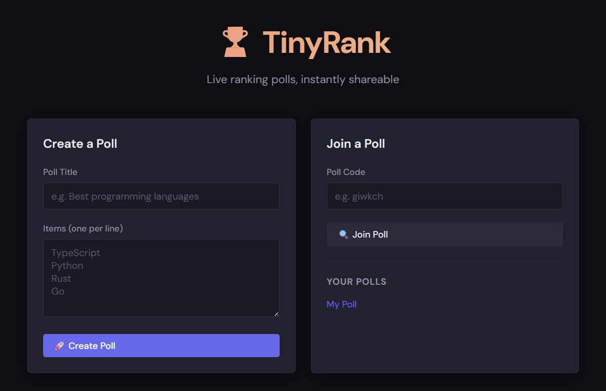

# TinyRank

A minimal, lightweight web application for live tier ranking polls.

Create a poll, share a short 6-character code, and watch participants rank items into tiers (S/A/B/C/D/E) in real time — no accounts required.



## Features

- **Anonymous & ephemeral** — cookie-based sessions, no sign-up, polls auto-delete after 7 days
- **Instant sharing** — 6-character codes (`/poll/giwkch`), case-insensitive
- **Live updates** — Server-Sent Events push every vote/item change to all viewers in real time
- **Auto-tiering** — items move between S/A/B/C/D/E tiers automatically based on vote score
- **Avatars** — deterministic SVG avatars generated from each participant's display name
- **Owner controls** — rename poll, delete items, delete poll

## Tech Stack

| Layer     | Technology                            |
| --------- | ------------------------------------- |
| Server    | Node.js · TypeScript · Express        |
| Client    | React · TypeScript · Vite             |
| Database  | In-memory · optional file persistence |
| Real-time | Server-Sent Events (SSE)              |

## Development

### Prerequisites

- **Node.js** v18 or later
- **npm** v9 or later

### Install dependencies

```bash
# From the repo root — installs root, server, and client deps in one go
npm run install:all
```

Or install each workspace separately:

```bash
npm install
cd server && npm install
cd ../client && npm install
```

### Run in development mode

The server and client need to run in **two separate terminals**.

**Terminal 1 — API server** (port 3001):

```bash
cd server
npm run dev
```

**Terminal 2 — Vite dev server** (port 5173, proxies `/api` → `localhost:3001`):

```bash
cd client
npm run dev
```

Open [http://localhost:5173](http://localhost:5173) in your browser.

> The Vite dev server is configured to proxy all `/api` requests to the Express server, so CSRF cookies and session cookies work correctly across both ports.

### Environment variables (development)

No variables are required for local development. The following optional variables are available:

| Variable              | Default                    | Description                                                                                                                |
| --------------------- | -------------------------- | -------------------------------------------------------------------------------------------------------------------------- |
| `PORT`                | `3001`                     | Port the Express server listens on                                                                                         |
| `CSRF_SECRET`         | `tinyrank-dev-csrf-secret` | Secret used to sign CSRF tokens — **change this in production**                                                            |
| `NODE_ENV`            | —                          | Set to `production` to serve the built client from the server                                                              |
| `STATE_FILE`          | —                          | Path to a JSON file for opt-in state persistence (e.g. `./data/state.json`). See [State Persistence](#state-persistence).  |
| `S3_BUCKET`           | —                          | S3 bucket name for opt-in S3 persistence. Takes precedence over `STATE_FILE`. See [State Persistence](#state-persistence). |
| `S3_KEY`              | `tinyrank-state.json`      | Object key used within the S3 bucket.                                                                                      |
| `S3_REGION`           | `us-east-1`                | AWS region of the bucket.                                                                                                  |
| `S3_ENDPOINT`         | —                          | Custom endpoint URL for S3-compatible services (MinIO, Cloudflare R2, etc.).                                               |
| `S3_FORCE_PATH_STYLE` | —                          | Set to `true` to use path-style access (required by some S3-compatible services).                                          |

## Production Build & Deployment

TinyRank is designed to run as a single Node.js process in production — the Express server builds and serves the React client as static files.

### 1. Build

```bash
# From the repo root
npm run build
```

This runs `tsc` in `server/` (outputs to `server/dist/`) and `vite build` in `client/` (outputs to `client/dist/`).

### 2. Set environment variables

```bash
export NODE_ENV=production
export PORT=3001                      # or whichever port your host exposes
export CSRF_SECRET=your-random-secret # generate with: openssl rand -hex 32
```

### 3. Start the server

```bash
cd server
npm start          # runs: node dist/index.js
```

The server will:

- Serve the React SPA from `client/dist/` for all non-API routes
- Handle all API and SSE requests under `/api/`

### Deploying to a cloud host

Because the only runtime dependency is **Node.js**, TinyRank deploys to any platform that runs Node:

**Railway / Render / Fly.io / similar PaaS**

1. Set the build command to `npm run install:all && npm run build`.
2. Set the start command to `cd server && npm start`.
3. Add `NODE_ENV=production` and `CSRF_SECRET=<secret>` as environment variables.
4. Expose the port defined by `PORT` (most platforms inject `PORT` automatically).

**Manual VPS / Docker**

```dockerfile
FROM node:20-alpine
WORKDIR /app
COPY . .
RUN npm run install:all && npm run build
ENV NODE_ENV=production
ENV PORT=3001
EXPOSE 3001
CMD ["node", "server/dist/index.js"]
```

### Important production notes

- **Data is in-memory by default.** All polls are lost on process restart. Enable file-based or S3 persistence (see [State Persistence](#state-persistence)) if you need state to survive restarts.
- **Single instance only.** Because the store is in-memory, running multiple server instances will result in inconsistent state. Use a single-instance deployment.
- **Not compatible with serverless platforms.** TinyRank requires a long-running server process. Serverless environments (Vercel, AWS Lambda, Netlify Functions, Cloudflare Workers) are not suitable because SSE connections rely on cross-request broadcast — when one client votes, all other clients' open SSE connections receive the update. Serverless functions are stateless and isolated, so the in-memory client registry and poll store cannot be shared across invocations.
- **Set `CSRF_SECRET`** to a long random string in production; the default is insecure.

## State Persistence

By default, TinyRank keeps all data in memory and nothing survives a restart. Two opt-in persistence backends are available.

### File-based persistence

Set `STATE_FILE` to a writable path on the local filesystem:

```bash
export STATE_FILE=./data/state.json
```

### S3 / S3-compatible bucket

Set `S3_BUCKET` to persist state to an S3 bucket. S3 mode takes precedence over `STATE_FILE` if both are set.

**AWS S3:**

```bash
export S3_BUCKET=my-tinyrank-bucket
export S3_REGION=us-east-1          # optional, defaults to us-east-1
export S3_KEY=tinyrank-state.json   # optional object key

# Standard AWS credentials — use env vars, an IAM role, or any credential provider
export AWS_ACCESS_KEY_ID=...
export AWS_SECRET_ACCESS_KEY=...
```

**S3-compatible services (MinIO, Cloudflare R2, etc.):**

```bash
export S3_BUCKET=my-tinyrank-bucket
export S3_ENDPOINT=https://my-minio.example.com   # custom endpoint
export S3_FORCE_PATH_STYLE=true                   # required for MinIO
export AWS_ACCESS_KEY_ID=...
export AWS_SECRET_ACCESS_KEY=...
```

### Behavior (both backends)

- **On startup**, TinyRank loads the stored state and restores all non-expired polls and sessions.
- **Every 60 seconds**, TinyRank writes the current state automatically (limits data loss on crash to ≤ 60 s).
- **On shutdown** (`SIGTERM` or `SIGINT`), TinyRank performs a final write before exiting, so a graceful restart loses no data.

For the file backend, writes are atomic (written to a `.tmp` sibling file then renamed) to prevent corruption if the process is killed mid-write.

> **Note:** Both backends are intended for single-instance deployments. They are not suitable for running multiple server processes against the same storage simultaneously.

## API Reference

All endpoints are prefixed with `/api`. State-changing requests (`POST`, `PATCH`, `DELETE`) require an `X-CSRF-Token` header obtained from `GET /api/csrf-token`.

| Method   | Path                              | Description                           |
| -------- | --------------------------------- | ------------------------------------- |
| `GET`    | `/api/csrf-token`                 | Get a CSRF token                      |
| `GET`    | `/api/session`                    | Get current session                   |
| `PATCH`  | `/api/session`                    | Set display name (`{ username }`)     |
| `POST`   | `/api/polls`                      | Create poll (`{ title, items[] }`)    |
| `GET`    | `/api/polls/:code`                | Get poll + `isOwner` flag             |
| `PATCH`  | `/api/polls/:code`                | Rename poll title (owner only)        |
| `DELETE` | `/api/polls/:code`                | Delete poll (owner only)              |
| `POST`   | `/api/polls/:code/items`          | Add item (`{ text }`)                 |
| `DELETE` | `/api/polls/:code/items/:id`      | Delete item (owner only)              |
| `POST`   | `/api/polls/:code/items/:id/vote` | Vote (`{ vote: "up"\|"down"\|null }`) |
| `GET`    | `/api/poll/:code/events`          | SSE stream of live poll updates       |

## Tiering Logic

Items are assigned a tier automatically from their score (`upvotes − downvotes`):

| Tier | Score       |
| ---- | ----------- |
| S    | ≥ 1         |
| A    | 0 (default) |
| B    | −1 to −2    |
| C    | −3 to −4    |
| D    | −5 to −6    |
| E    | ≤ −7        |

## Limits

| Limit               | Value          |
| ------------------- | -------------- |
| Polls per session   | 10             |
| Global polls        | 5,000          |
| Items per poll      | 25             |
| Poll lifetime       | 7 days         |
| Poll title length   | 100 characters |
| Item text length    | 200 characters |
| Display name length | 32 characters  |
